# MATRIX

The project is an introduction of linear algebra.
It is the study of vector spaces, which consist of objects called vectors.
Transformations of vectors, called linear maps, are generally represented as objects
called "matrices" in the most usual (finite-dimensional) case.

## Launch

To launch the projet with the examples of suject, run the command `cargo run`.

To launch the additional tests, run the command `cargo test`.

To generate the documentation : `cargo doc`.

## Vectors

A vector is simply a list of numbers, but geometrically, it is an arrow that has a direction and a length.

- **Addition**: This is the operation of combining movements. If we move along one vector and then along another, the final vector represents the direct path from the starting point to the end point.
- **Subtraction**: This allows you to calculate the vector that connects two points in space. It is essential for determining the distance and direction needed to travel from object A to object B.
- **Scaling**: This involves multiplying all the components of a vector by a number (scalar). This allows the arrow to be lengthened or shortened without changing its direction, for example to accelerate an object or enlarge a 3D model.

### Linear combination

This is the universal recipe for vectors. Take several vectors, scale them differently, and add them together to create a new position.
This allows new vectors to be generated from an existing base. For example, any color on your screen is a linear combination of Red, Green, and Blue with different intensities.

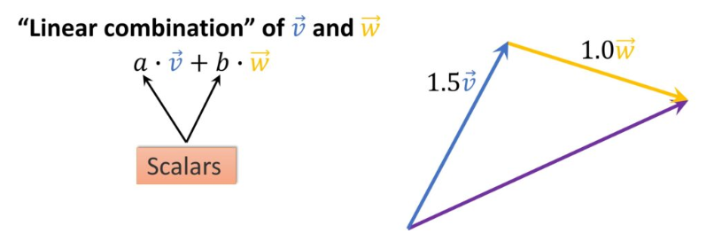

### Linear interpolation

This function allows you to find any point on the segment connecting two vectors. It uses a parameter t (between 0 and 1) that acts as a cursor.
If t=0, we are at the start; if t=1, we are at the end; if t=0.5, we are right in the middle. This is the basic tool for animation and smooth movements between two positions.

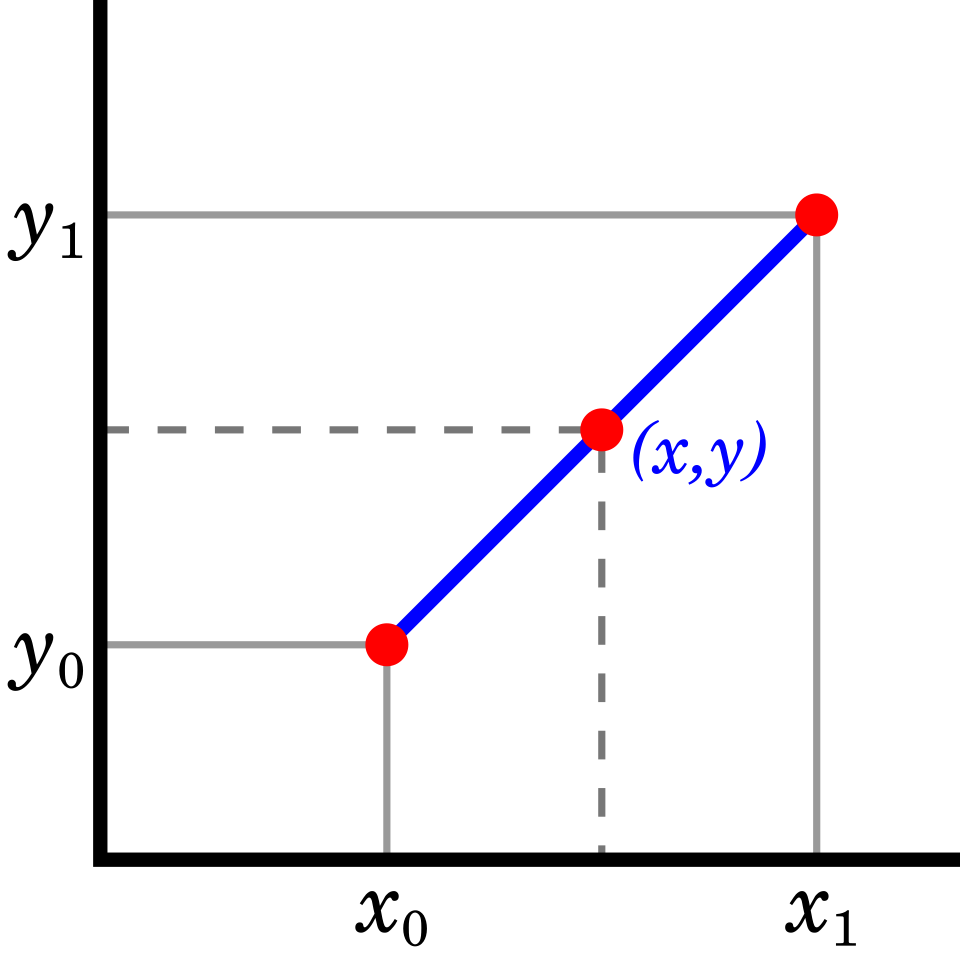

### Dot product

This operation multiplies two vectors to give a single number (a scalar). This number tells us about the relationship between the two vectors: do they point in the same direction?
If the product is zero, the vectors are perpendicular (orthogonal). This is crucial for 3D lighting calculations (knowing whether a face is facing the light).

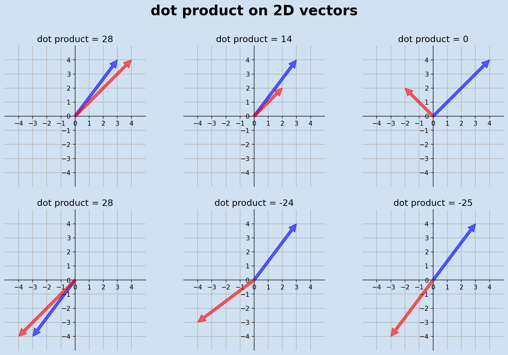

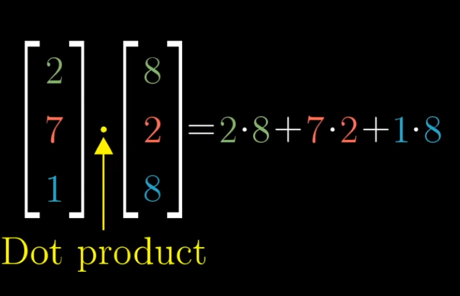

### Norm

The norm measures the “magnitude” or length of a vector, but the method of measurement may vary:
- **Euclidean norm** (norm2): It is the class "as the crow flies" distance.
- **Manhattan norm** (norm1): It is the addition of absolute values of the coordinates, as if moving along a grid of streets.
- **Supremum norm** (norm inf): It is the largest coordinate.

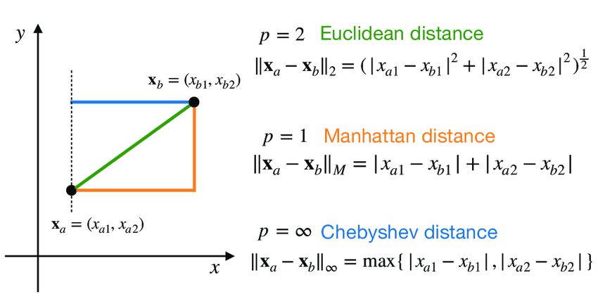

### Cosine

Find the exact angle between two vectors, regardless of their length. We use the dot product to calculate it.
This gives us a pure value between -1 and 1 that describes the exact angle between two objects.

### Cross product

Specific to 3D, this operation takes two vectors and creates a third that is perpendicular to the first two.
This is essential in physics and 3D to find, for example, the axis around which an object should rotate, or to determine the “normal” (orientation) of a triangular surface.

## Matrix

### Multiplication
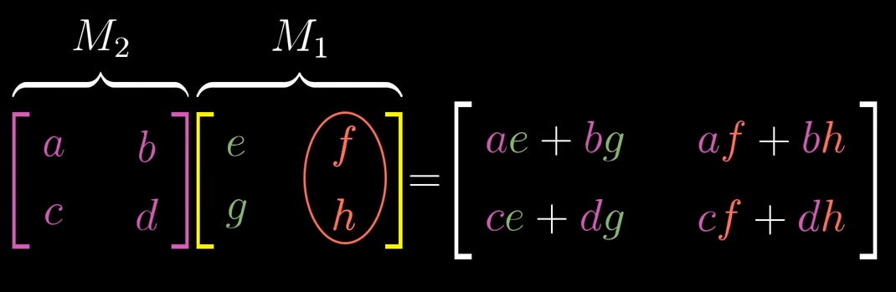

### Linear Map
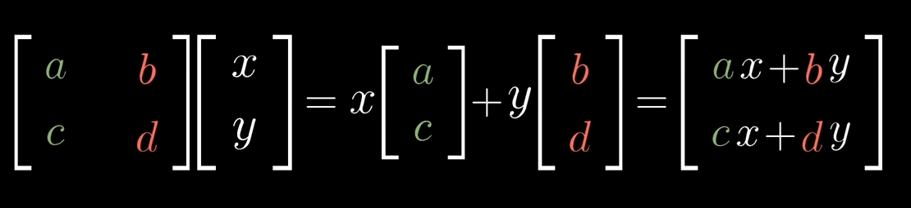

### Trace

The trace is the sum of the elements located on the main diagonal of a square matrix.
It is a “signature” of the matrix that has the interesting property of not changing even if the reference frame (the basis) in which the transformation is described is changed.

### Transpose

Transposing a matrix is equivalent to inverting it with respect to its diagonal: rows become columns and vice versa.
This is a common technical operation, used for example to adapt data to the format expected by a graphics card or for certain statistical calculations.

### Row-echelon form

The goal is to simplify a matrix so that it takes on a triangular shape (with zeros in the lower left corner).
This corresponds to the Gaussian elimination method: unknowns in a system of equations are gradually eliminated so that it can be easily solved, step by step.

### Determinant

The determinant is a number that indicates how the matrix transformation changes volumes (or areas in 2D).
If it is 2, the matrix doubles the volume. If it is 0, the matrix “flattens” the volume, which means that the information is lost and the transformation is irreversible.
Its absolute value (the number without the sign) gives the magnification factor, but its sign indicates the orientation of the space. A negative sign means that the space has been “flipped.”

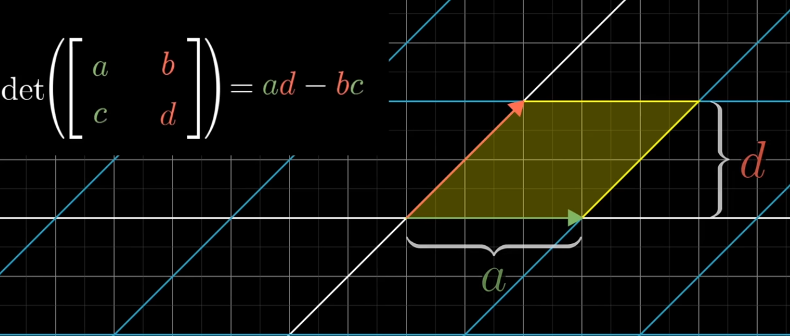
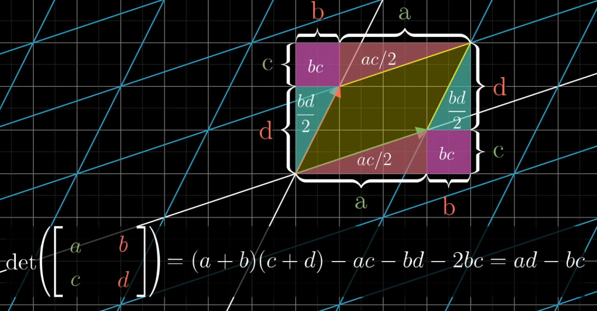
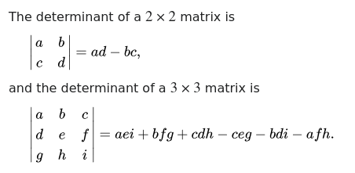

### Inverse

The inverse of a matrix A is the matrix A−1, which cancels out the effect of A, returning us to the initial state.
Calculating the inverse allows you to “divide” by a matrix, which is necessary to solve systems of equations of the type Ax=b by finding x=A−1b.
It is impossible if the determinant is 0 (because you can't give volume back to a flat surface).

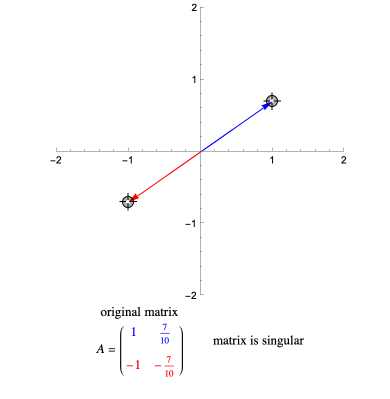

### Rank

The rank indicates the number of real dimensions that the matrix retains after transformation.
If I have a 3x3 matrix but it overwrites everything on one line, its rank is 1.
This helps to understand the loss of information during a transformation.

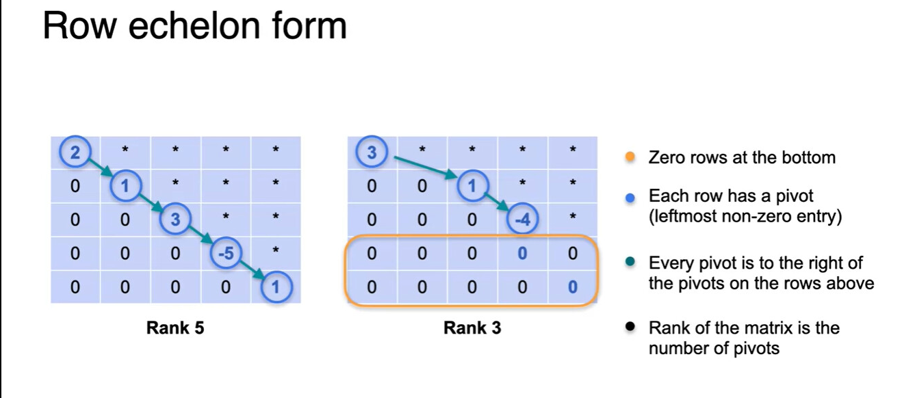

## Complex vector spaces

In the mandatory section, we used “normal” numbers to construct our vectors and matrices. In mathematics, this is called the set of real numbers ℝ.
A complex vector space works exactly the same way, but we replace our conventional numbers with complex numbers ℂ.
A real number is a point on a line, whereas a complex number has two dimensions. A complex number consists of a real part and an “imaginary” part.

Instead of being a point on a line, a complex number is a point on a geometric map, with a real x-coordinate and an imaginary y-coordinate.

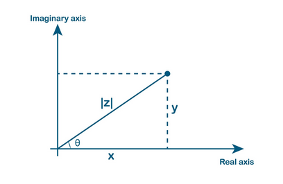

A complex scalar already contains 2 dimensions of information! So a 1D complex vector space (a vector with a single complex number) visually resembles a 2D plane.
If you have a complex vector in 2D, it's equivalent to 4 real spatial dimensions!

Scaling becomes rotation, meaning that when we multiply a real vector by two, we stretch it. However, when we multiply a vector by a complex number, the operation acts as a “rotation-scaling” matrix. Changing the scale of a complex vector will therefore change its length but also rotate it.

## Resources

[3Blue1Brown - Essence of linear algebra](https://www.youtube.com/watch?v=fNk_zzaMoSs&list=PLZHQObOWTQDPD3MizzM2xVFitgF8hE_ab&index=1)
