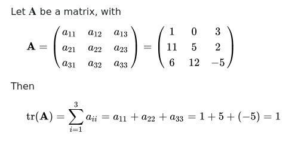
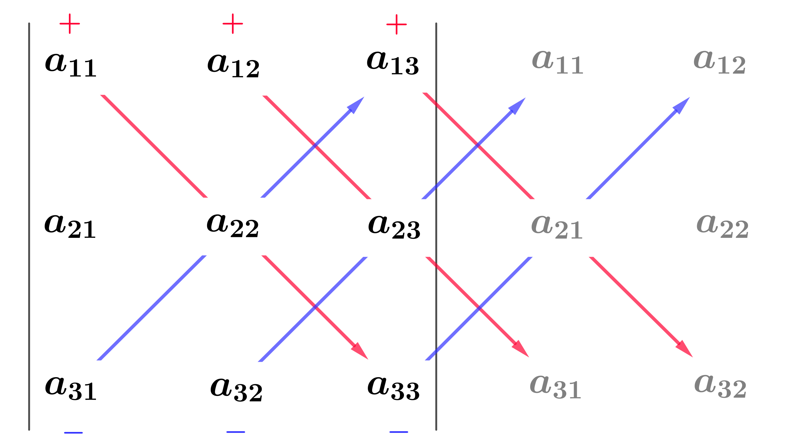

# MATRIX

The project is an introduction of linear algebra.
It is the study of vector spaces, which consist of objects called vectors. Tranformations
of vectors, called linear maps, are generally represented as objects called "matrices" in
the most usual (finite-dimensional) case.

### Resource
[3Blue1Brown - Essence of linear algebra](https://www.youtube.com/watch?v=fNk_zzaMoSs&list=PLZHQObOWTQDPD3MizzM2xVFitgF8hE_ab&index=1)

### Greek alphabet

## Exercise 00 - Add, Subtract and Scale
| Allowed Functions  | Max time complexity | Max space complexity |
|:------------------:|:-------------------:|:--------------------:|
|        None        |        O(n)         |         O(n)         |

### [Vectors](https://www.youtube.com/watch?v=fNk_zzaMoSs&list=PLZHQObOWTQDPD3MizzM2xVFitgF8hE_ab&index=1&t=9s)
- Add: [x1, y1] + [x2, y2] = [x1 + x2, y1 + y2]
- Subtract: [x1, y1] - [x2, y2] = [x1 - x2, y1 - y2]
- Scale: [x, y] * scalar = [x * scalar, y * scalar]

### Matrix
- Add: [[x1a, y1a],[x1b, y1b]] + [[x2a, y2a], [x2b, y2b]] = [[x1a + x2a, y1a + y2a], [x1b + x2b, y1a + y2b]]
- Subtract:[[x1a, y1a],[x1b, y1b]] - [[x2a, y2a], [x2b, y2b]] = [[x1a - x2a, y1a - y2a], [x1b - x2b, y1a - y2b]]
- Scale: [[x1, y1], [x2, y2]] * scalar = [[x1 * scalar, y1 * scalar], [x2 * scalar, y2 * scalar]]

## Exercise 01 - Linear combination
|      Allowed Functions      | Max time complexity | Max space complexity |
|:---------------------------:|:-------------------:|:--------------------:|
| fused multiply-add function |        O(n)         |         O(n)         |

"In mathematics, a linear combination or superposition is an expression constructed from a set of terms by multiplying each term by a constant and adding the results (e.g. a linear combination of x and y would be any expression of the form ax + by, where a and b are constants)." [cf](https://en.wikipedia.org/wiki/Linear_combination) [video](https://www.youtube.com/watch?v=k7RM-ot2NWY&list=PLZHQObOWTQDPD3MizzM2xVFitgF8hE_ab&index=2&#41)

## Exercise 02 - Linear interpolation
|      Allowed Functions      | Max time complexity | Max space complexity |
|:---------------------------:|:-------------------:|:--------------------:|
| fused multiply-add function |        O(n)         |         O(n)         |

"In mathematics, linear interpolation is a method of curve fitting using linear polynomials to construct new data points within the range of a discrete set of known data points." [cf](https://en.wikipedia.org/wiki/Linear_interpolation)

## Exercise 03 - Dot product
|      Allowed Functions      | Max time complexity | Max space complexity |
|:---------------------------:|:-------------------:|:--------------------:|
| fused multiply-add function |        O(n)         |         O(n)         |

"In mathematics, the dot product is an algebraic operation that takes two equal-length sequences of numbers (usually coordinate vectors), and returns a single number. [...] Algebraically, the dot product is the sum of the products of the corresponding entries of the two sequences of numbers. Geometrically, the scalar product of two vectors is the product of their lengths and the cosine of the angle between them." [cf](https://en.wikipedia.org/wiki/Dot_product)

[Explanations](https://www.youtube.com/watch?v=LyGKycYT2v0&list=PLZHQObOWTQDPD3MizzM2xVFitgF8hE_ab&index=9)

## Exercise 04 - Norm
|           Allowed Functions            | Max time complexity | Max space complexity |
|:--------------------------------------:|:-------------------:|:--------------------:|
| fused multiply-add function, pow, max  |        O(n)         |         O(n)         |

## Exercise 05 - Cosine
|      Allowed Functions      | Max time complexity | Max space complexity |
|:---------------------------:|:-------------------:|:--------------------:|
| fused multiply-add function |        O(n)         |         O(n)         |

## Exercise 06 - Cross product
|      Allowed Functions      | Max time complexity | Max space complexity |
|:---------------------------:|:-------------------:|:--------------------:|
| fused multiply-add function |         N/A         |         N/A          |

"In mathematics, the cross product or vector product is a binary operation on two vectors in a three-dimensional oriented Euclidean vector space, and is denoted by the symbol ×." [cf](https://en.wikipedia.org/wiki/Cross_product)

[Explanations](https://www.youtube.com/watch?v=eu6i7WJeinw&list=PLZHQObOWTQDPD3MizzM2xVFitgF8hE_ab)

## Exercise 07 - Linear map, Matrix multiplication

## Exercise 08 - Trace
|      Allowed Functions      | Max time complexity | Max space complexity |
|:---------------------------:|:-------------------:|:--------------------:|
| fused multiply-add function |        O(n)         |         N/A          |

## Exercise 09 - Transpose
|      Allowed Functions      | Max time complexity | Max space complexity  |
|:---------------------------:|:-------------------:|:---------------------:|
| fused multiply-add function |        O(nm)        |         O(nm)         |

"In linear algebra, the transpose of a matrix is an operator that flips a matrix over its diagonal; that is, transposition switches the row and column indices of the matrix A to produce another matrix" [cf](https://en.wikipedia.org/wiki/Transpose)

## Exercise 10 - row-echelon form
|      Allowed Functions      | Max time complexity | Max space complexity |
|:---------------------------:|:-------------------:|:--------------------:|
| fused multiply-add function |  O(n3)   |   O(n2)   |

## Exercise 11 - Determinant
|      Allowed Functions      | Max time complexity | Max space complexity |
|:---------------------------:|:-------------------:|:--------------------:|
| fused multiply-add function |  O(n3)   |   O(n2)   |

"In mathematics, the determinant is a scalar-valued function of the entries of a square matrix. The determinant of a matrix A is commonly denoted det(A), det A, or |A|. Its value characterizes some properties of the matrix and the linear map represented, on a given basis, by the matrix." [cf](https://en.wikipedia.org/wiki/Determinant)

[Explanations](https://www.youtube.com/watch?v=Ip3X9LOh2dk&list=PLZHQObOWTQDPD3MizzM2xVFitgF8hE_ab&index=8)

## Exercise 12 - Inverse
|      Allowed Functions      | Max time complexity | Max space complexity |
|:---------------------------:|:-------------------:|:--------------------:|
| fused multiply-add function |  O(n3)   |   O(n2)   |

[Explanations](https://www.youtube.com/watch?v=uQhTuRlWMxw)

Identity matrix : 
1 0 0
0 1 0
0 0 1

## Exercise 13 - Rank
|      Allowed Functions      | Max time complexity | Max space complexity |
|:---------------------------:|:-------------------:|:--------------------:|
| fused multiply-add function |  O(n3)   |         N/A          |

[Explanations](https://www.youtube.com/watch?v=uQhTuRlWMxw)

Number of non-null rows after reduced row-echelon.

## Exercise 15 - Bonus: Complex vector spaces